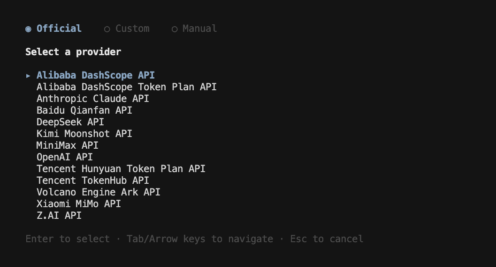

<div align="center">
  <a href="https://open-codereview.ai">
    
  </a>
  <h1>OpenCodeReview</h1>
</div>

<p align="center">
  <a href="https://trendshift.io/repositories/41087" target="_blank">
    
  </a>
</p>
<p align="center">
  <a href="https://www.npmjs.com/package/@alibaba-group/open-code-review"></a>
  <a href="https://github.com/alibaba/open-code-review/actions/workflows/release.yml"></a>
  <a href="https://github.com/alibaba/open-code-review/blob/main/LICENSE"></a>
  <a href="https://deepwiki.com/alibaba/open-code-review"></a>
  <a href="https://www.bestpractices.dev/projects/13328"></a>
</p>
<p align="center">
  <a href="#supported-platforms"></a>
  <a href="#supported-platforms"></a>
  <a href="#supported-platforms"></a>
  <a href="#supported-agents"></a>
  <a href="#supported-agents"></a>
  <a href="#supported-agents"></a>
</p>
<p align="center">
  <a href="README.md">English</a> | <a href="README.zh-CN.md">简体中文</a> | <a href="README.ja-JP.md">日本語</a> | <a href="README.ko-KR.md">한국어</a> | Русский
</p>

---

## Что такое Open Code Review?

Open Code Review — это CLI-инструмент для код-ревью на основе ИИ. Он появился как внутренний официальный ИИ-ассистент код-ревью Alibaba Group: за последние два года им воспользовались десятки тысяч разработчиков, и он выявил миллионы дефектов в коде. После тщательной проверки в огромных масштабах мы превратили его в open-source-проект для сообщества. Чтобы начать работу, достаточно настроить эндпоинт модели.

Инструмент читает git-диффы, отправляет изменённые файлы настраиваемой LLM через агента с поддержкой вызова инструментов (tool use) и генерирует структурированные ревью-комментарии с точностью до строки. Агент может читать полное содержимое файлов, искать по кодовой базе, заглядывать в другие изменённые файлы за контекстом и выполнять глубокое ревью — а не только давать поверхностные замечания по диффу. Помимо ревью диффов, `ocr scan` позволяет проверять файлы целиком — удобно для аудита незнакомой кодовой базы или каталогов без значимого диффа.

Подробнее на [официальном сайте](https://open-codereview.ai).


## Бенчмарк

> По сравнению с агентами общего назначения (Claude Code), Open Code Review при той же базовой модели достигает значительно более высоких показателей **Precision** и **F1**, потребляя лишь **~1/9 токенов** и выполняя ревью быстрее. При этом показатель Recall ниже, чем у агентов общего назначения — это осознанный компромисс в пользу точности и минимального шума.

Бенчмарк на основе реальных код-ревью: **50** популярных open-source-репозиториев, **200** реальных Pull Request, **10** языков программирования — перекрёстная валидация 80+ старшими инженерами (**1 505** размеченных дефектов).

| Метрика | Что измеряет | Почему важна |
|---------|-------------|--------------|
| **F1** | Гармоническое среднее precision и recall | Лучший единый показатель качества ревью |
| **Precision** | Доля найденных проблем, являющихся реальными дефектами | Выше = меньше ложных срабатываний |
| **Recall** | Доля реальных дефектов, которые были найдены | Выше = меньше пропущенных проблем |
| **Avg Time** | Время выполнения одного ревью | Влияет на задержки в CI-пайплайне |
| **Avg Token** | Суммарное потребление токенов за ревью | Прямо влияет на стоимость API |


## Почему Open Code Review?

### Проблема агентов общего назначения

Если вы использовали для код-ревью агентов общего назначения, например Claude Code со Skills, вы наверняка сталкивались с этими болевыми точками:

- **Неполное покрытие** — на крупных ченджсетах агенты склонны «срезать углы»: выборочно проверяют часть файлов и пропускают остальные.
- **Дрейф позиций** — найденные проблемы часто не совпадают с реальным местом в коде: номера строк и ссылки на файлы «уезжают» от цели.
- **Нестабильное качество** — Skills, управляемые естественным языком, трудно отлаживать, и качество ревью заметно колеблется при небольших изменениях промпта.

Первопричина: чисто языковая архитектура не накладывает жёстких ограничений на процесс ревью.

### Ключевая идея: детерминированная инженерия × агент

Ключевая философия Open Code Review — сочетать детерминированную инженерию и агента так, чтобы каждый занимался тем, что у него получается лучше всего.

**Детерминированная инженерия — жёсткие гарантии**

Для тех шагов ревью, где *нельзя ошибаться*, корректность гарантирует инженерная логика, а не языковая модель:

- **Точный отбор файлов** — точно определяет, какие файлы нуждаются в ревью, а какие следует отфильтровать, гарантируя, что ни одно важное изменение не будет упущено.
- **Умный бандлинг файлов** — группирует связанные файлы в одну единицу ревью (например, `message_en.properties` и `message_zh.properties` объединяются вместе). Каждый бандл выполняется как суб-агент с изолированным контекстом — стратегия «разделяй и властвуй», которая сохраняет стабильность на очень больших ченджсетах и естественным образом поддерживает конкурентное ревью.
- **Тонкий матчинг правил** — сопоставляет правила ревью с характеристиками каждого файла, удерживая внимание модели сфокусированным и устраняя информационный шум у самого источника. По сравнению с чисто языковым управлением правилами матчинг правил на основе шаблонизатора стабильнее и предсказуемее.
- **Внешние модули позиционирования и рефлексии** — независимые модули позиционирования комментариев и рефлексии над комментариями системно повышают точность как расположения, так и содержания замечаний ИИ.

**Агент — динамические решения**

Сильные стороны агента сосредоточены там, где они важнее всего, — в динамических решениях и динамическом доборе контекста:

- **Промпты, заточенные под сценарий** — шаблоны промптов, глубоко оптимизированные под код-ревью: выше качество при меньшем расходе токенов.
- **Набор инструментов, заточенный под сценарий** — выведен из глубокого анализа трейсов вызовов инструментов на больших продакшен-данных, включая распределение частоты вызовов, долю повторных вызовов каждого инструмента и влияние новых инструментов на всю цепочку вызовов. В результате получился специализированный набор инструментов, который для код-ревью стабильнее и предсказуемее, чем универсальный агентский тулкит.

## Как использовать

### Предварительные требования

- **Git >= 2.41** — Open Code Review использует Git для генерации diff, поиска по коду и операций с репозиторием.

### CLI

#### Установка

**Через NPM (рекомендуется)**

```bash
npm install -g @alibaba-group/open-code-review
```

После установки команда `ocr` доступна глобально.

**Обновление**

Если установка выполнена через NPM, обновите вручную до последней версии:

```bash
npm install -g @alibaba-group/open-code-review@latest
```

Установка через NPM также по умолчанию проверяет новые версии в фоне и обновляется автоматически. Чтобы отключить автообновления, задайте `OCR_NO_UPDATE=1`.

Если вы устанавливали через install script или вручную скачанный бинарный файл, повторно запустите ту же команду установки/скачивания, чтобы заменить локальный бинарный файл последним релизом. Используйте `OCR_VERSION`, если нужно зафиксировать конкретный тег релиза.

**Из GitHub Release**

Установите свежий бинарный файл для вашей ОС/архитектуры одной командой (macOS / Linux):

```bash
curl -fsSL https://raw.githubusercontent.com/alibaba/open-code-review/main/install.sh | sh
```

Скрипт сам выбирает подходящий бинарный файл релиза, проверяет его контрольную сумму SHA-256 и устанавливает его как `ocr` в `/usr/local/bin`. Каталог установки можно переопределить через `OCR_INSTALL_DIR`, а версию релиза зафиксировать через `OCR_VERSION`:

```bash
OCR_INSTALL_DIR="$HOME/.local/bin" OCR_VERSION=v1.3.13 \
  sh -c "$(curl -fsSL https://raw.githubusercontent.com/alibaba/open-code-review/main/install.sh)"
```

В Windows (PowerShell 5.1+):

```powershell
irm https://raw.githubusercontent.com/alibaba/open-code-review/main/install.ps1 | iex
```

Скрипт сам выбирает подходящий Windows-бинарный файл релиза, проверяет его контрольную сумму SHA-256 и устанавливает его как `ocr.exe` в `%LOCALAPPDATA%\Programs\ocr`. Каталог установки можно переопределить через `OCR_INSTALL_DIR`, а версию релиза зафиксировать через `OCR_VERSION`:

```powershell
$env:OCR_INSTALL_DIR = "$env:USERPROFILE\bin"
$env:OCR_VERSION = "v1.3.13"
irm https://raw.githubusercontent.com/alibaba/open-code-review/main/install.ps1 | iex
```

Передача удалённого скрипта напрямую в shell выполняет код из интернета. Лучше сначала скачать и просмотреть скрипт:

```bash
curl -fsSL https://raw.githubusercontent.com/alibaba/open-code-review/main/install.sh -o install.sh
less install.sh && sh install.sh
```

```powershell
irm https://raw.githubusercontent.com/alibaba/open-code-review/main/install.ps1 -OutFile install.ps1
notepad install.ps1   # просмотрите, затем: .\install.ps1
```

<details>
<summary>Ручная загрузка (все платформы, включая Windows)</summary>

Скачайте бинарный файл для вашей платформы со страницы [GitHub Releases](https://github.com/alibaba/open-code-review/releases):

```bash
# macOS (Apple Silicon)
curl -Lo ocr https://github.com/alibaba/open-code-review/releases/latest/download/opencodereview-darwin-arm64
chmod +x ocr && sudo mv ocr /usr/local/bin/ocr

# macOS (Intel)
curl -Lo ocr https://github.com/alibaba/open-code-review/releases/latest/download/opencodereview-darwin-amd64
chmod +x ocr && sudo mv ocr /usr/local/bin/ocr

# Linux (x86_64)
curl -Lo ocr https://github.com/alibaba/open-code-review/releases/latest/download/opencodereview-linux-amd64
chmod +x ocr && sudo mv ocr /usr/local/bin/ocr

# Linux (ARM64)
curl -Lo ocr https://github.com/alibaba/open-code-review/releases/latest/download/opencodereview-linux-arm64
chmod +x ocr && sudo mv ocr /usr/local/bin/ocr

# Windows (x86_64) — переместите ocr.exe в каталог из вашего PATH
curl -Lo ocr.exe https://github.com/alibaba/open-code-review/releases/latest/download/opencodereview-windows-amd64.exe

# Windows (ARM64) — переместите ocr.exe в каталог из вашего PATH
curl -Lo ocr.exe https://github.com/alibaba/open-code-review/releases/latest/download/opencodereview-windows-arm64.exe
```

</details>

**Из исходников**

```bash
git clone https://github.com/alibaba/open-code-review.git
cd open-code-review
make build
sudo cp dist/opencodereview /usr/local/bin/ocr
```

#### Быстрый старт

**1. Настройте LLM**

**Перед запуском ревью необходимо настроить LLM.**

OCR управляет конфигурацией LLM через единую систему **провайдеров (Provider)**. Множество популярных провайдеров встроено, также поддерживается добавление пользовательских провайдеров для подключения к приватным развёртываниям или другим совместимым эндпоинтам. Конфигурация хранится в `~/.opencodereview/config.json`.

**Вариант A: интерактивная настройка (рекомендуется)**

```bash
ocr config provider          # Выбрать встроенного провайдера или добавить пользовательский
ocr config model             # Выбрать модель для активного провайдера
```



Интерактивный UI проведёт вас через выбор провайдера, ввод API-ключа и настройку модели, после чего автоматически проверит подключение.

Выполните `ocr llm providers`, чтобы увидеть все встроенные провайдеры. У встроенных провайдеров предустановлены URL API и протокол — достаточно указать API-ключ. Если соответствующая переменная окружения уже задана (например, `ANTHROPIC_API_KEY`, `OPENAI_API_KEY`), API-ключ будет подхвачен автоматически.

**Пользовательские провайдеры** также добавляются через интерактивный UI — потребуется указать имя, URL API, тип протокола (`anthropic` или `openai`) и API-ключ.

**Вариант B: настройка через CLI (для CI/CD и неинтерактивных сред)**

Используйте `ocr config set` для записи конфигурации провайдера напрямую — подходит для скриптов и автоматизации.

Использование встроенного провайдера:

```bash
ocr config set provider anthropic
ocr config set providers.anthropic.api_key your-api-key-here
ocr config set providers.anthropic.model claude-sonnet-4-6
```

Использование пользовательского провайдера (приватный шлюз или другой совместимый эндпоинт):

```bash
ocr config set provider my-gateway
ocr config set custom_providers.my-gateway.url https://my-llm-gateway.internal/v1
ocr config set custom_providers.my-gateway.protocol openai
ocr config set custom_providers.my-gateway.api_key your-api-key-here
ocr config set custom_providers.my-gateway.model gpt-4o
```

> Для пользовательских провайдеров `url` и `protocol` обязательны. Поддерживаемые протоколы: `anthropic`, `openai`, `openai-responses`.

Дополнительные настройки:

| Ключ | Описание |
|------|----------|
| `providers.<name>.auth_header` | Заголовок аутентификации: `x-api-key` или `authorization` (по умолчанию: `authorization`) |
| `providers.<name>.extra_body` | Пользовательские JSON-поля, добавляемые в тело запроса |
| `providers.<name>.extra_headers` | Пары `key=value`, разделённые запятыми — пользовательские HTTP-заголовки для каждого запроса |
| `providers.<name>.models` | Список моделей для интерактивного выбора |

**`extra_headers` (необязательно):** добавляет пользовательские HTTP-заголовки к каждому запросу к LLM API. Полезно для прокси, шлюзов или корпоративных эндпоинтов, требующих дополнительных заголовков (например, ID организации, ID трассировки). Формат — пары `key=value`, разделённые запятыми. Значения с запятыми заключается в двойные кавычки:

```bash
ocr config set llm.extra_headers "X-Org-ID=org-123,X-Forwarded-For=\"1.2.3.4,5.6.7.8\""
```

Дополнительные заголовки также можно задать для отдельного провайдера:

```bash
ocr config set providers.anthropic.extra_headers "X-Org-ID=org-123"
```

**Переменные окружения (наивысший приоритет)**

Переменные окружения переопределяют настройки из файла конфигурации — удобно в CI/CD, где запись в конфиг-файл затруднена:

```bash
export OCR_LLM_URL=https://api.anthropic.com/v1/messages
export OCR_LLM_TOKEN=your-api-key-here
export OCR_LLM_MODEL=claude-opus-4-6
export OCR_USE_ANTHROPIC=true
```

Чтобы использовать OpenAI Responses API (модели GPT-5.x / o-series), задайте `OCR_LLM_PROTOCOL` вместо `OCR_USE_ANTHROPIC`:

```bash
export OCR_LLM_URL=https://api.openai.com/v1
export OCR_LLM_TOKEN=your-openai-key
export OCR_LLM_MODEL=gpt-5.4
export OCR_LLM_PROTOCOL=openai-responses
```

`OCR_LLM_PROTOCOL` принимает значения `anthropic`, `openai`, `openai-responses` и имеет приоритет над `OCR_USE_ANTHROPIC`, если заданы обе переменные.

Также совместим с переменными окружения Claude Code (`ANTHROPIC_BASE_URL`, `ANTHROPIC_AUTH_TOKEN`, `ANTHROPIC_MODEL`) и разбирает `~/.zshrc` / `~/.bashrc` в поисках соответствующих export'ов.

> **Примечание для пользователей CC-Switch**: если вы используете [CC-Switch](https://github.com/farion1231/cc-switch) с включённым [routing service](https://www.ccswitch.io/en/docs?section=proxy&item=service), можно указать в `url` провайдера адрес прокси CC-Switch без дополнительной настройки:
> - Для провайдера **Claude**: установите `providers.anthropic.url` в `http://127.0.0.1:15721`
> - Для провайдера **Codex**: установите `url` соответствующего провайдера в `http://127.0.0.1:15721/v1`
> - `api_key` может быть любым, настройки `extra_body` продолжают действовать

**2. Проверьте подключение**

```bash
ocr llm test
```

**3. Запустите ревью**

```bash
cd your-project

# Режим рабочей копии — ревью всех staged, unstaged и untracked изменений
ocr review

# Диапазон веток — сравнение двух ref'ов
ocr review --from main --to feature-branch

# Один коммит
ocr review --commit abc123

# Возобновить прерванное ревью диапазона или одного коммита
ocr session list
ocr review --from main --to feature-branch --resume <session-id>

# Полнофайловое сканирование — ревью целых файлов вместо диффа (история git не нужна)
ocr scan                          # сканировать весь репозиторий
ocr scan --path internal/agent    # сканировать каталог или конкретные файлы

# Режим делегирования — AI-агент сам выполняет ревью
# OCR отвечает за выбор файлов и разрешение правил; настройка LLM не требуется
ocr delegate preview
ocr delegate rule src/main.go src/handler.go
```

### Интеграция с кодинг-агентами

OCR легко встраивается в ИИ-агентов для разработки в виде slash-команды, позволяя выполнять код-ревью прямо в рабочем процессе агента.

#### Вариант 1: установка как Skill

Установите скилл OCR в свой проект через `npx`:

```bash
npx skills add alibaba/open-code-review --skill open-code-review
```

Это установит скилл `open-code-review` из [реестра скиллов](skills/open-code-review/SKILL.md), который объясняет вашему кодинг-агенту, как вызывать `ocr` для код-ревью, классифицировать найденные проблемы по приоритету и при необходимости применять исправления.

**Режим делегирования** — если вы хотите, чтобы AI-агент сам выполнял ревью (OCR отвечает только за выбор файлов и разрешение правил, настройка LLM на стороне OCR не требуется):

```bash
npx skills add alibaba/open-code-review --skill open-code-review-delegate
```

Подробнее см. [skills/open-code-review-delegate/SKILL.md](skills/open-code-review-delegate/SKILL.md).

#### Вариант 2: установка как плагин Claude Code

Для [Claude Code](https://docs.anthropic.com/en/docs/claude-code) установите плагин с командой, выполнив в Claude Code:

```bash
/plugin marketplace add alibaba/open-code-review
/plugin install open-code-review@open-code-review
```

Это зарегистрирует slash-команду `/open-code-review:review`, которая запускает OCR и автоматически фильтрует и исправляет найденные проблемы. Также предоставляется команда `/open-code-review:delegate-review` для режима делегирования (агент выполняет ревью своими силами, OCR отвечает за выбор файлов и разрешение правил).

#### Вариант 3: установка как плагин Codex

Для локального Codex установите плагин Open Code Review из этого репозитория:

```bash
codex plugin marketplace add alibaba/open-code-review
codex
/plugins
```

Для локального чекаута или форка:

```bash
codex plugin marketplace add .
codex
/plugins
```

Установите и включите `Open Code Review`, затем начните новый тред Codex и вызывайте плагин явно:

```text
@Open Code Review review my current changes
@Open Code Review review this branch against main
@Open Code Review review and fix high-confidence issues
```

Это зарегистрирует Codex-скилл, запускающий локальный CLI OCR:

```bash
ocr review --audience agent
```

Эта интеграция не меняет внутренний LLM-бэкенд OCR и не требует настройки эндпоинта OpenAI Responses API для Codex. Самому OCR по-прежнему нужен установленный и настроенный CLI `ocr`, как описано в разделе про настройку CLI.

Руководство на корейском: [`plugins/open-code-review/CODEX.ko-KR.md`](plugins/open-code-review/CODEX.ko-KR.md)

#### Вариант 4: установка как плагин Cursor

Для [Cursor](https://www.cursor.com/) установите плагин Open Code Review из этого репозитория:

```
cursor-plugin marketplace add alibaba/open-code-review
```

Или добавьте маркетплейс вручную. В Cursor откройте `/plugins`, найдите `Open Code Review` и установите.

Для локального чекаута или форка:

```
cursor-plugin marketplace add .
```

После установки вызывайте плагин в Cursor:

```text
@Open Code Review review my current changes
@Open Code Review review this branch against main
@Open Code Review review and fix high-confidence issues
```

Это зарегистрирует Cursor-скилл, запускающий локальный CLI OCR:

```bash
ocr review --audience agent
```

Эта интеграция не меняет внутренний LLM-бэкенд OCR. Самому OCR по-прежнему нужен установленный и настроенный CLI `ocr`, как описано в разделе про настройку CLI.

#### Вариант 5: просто скопировать файл команды

Для быстрой настройки без пакетных менеджеров достаточно скопировать файл команды, чтобы использовать slash-команду `/open-code-review` в Claude Code.

**На уровне проекта** (общий для команды через git):

```bash
mkdir -p .claude/commands
curl -o .claude/commands/open-code-review.md \
  https://raw.githubusercontent.com/alibaba/open-code-review/main/plugins/open-code-review/claude-code/commands/review.md
```

**На уровне пользователя** (личное глобальное использование во всех проектах):

```bash
mkdir -p ~/.claude/commands
curl -o ~/.claude/commands/open-code-review.md \
  https://raw.githubusercontent.com/alibaba/open-code-review/main/plugins/open-code-review/claude-code/commands/review.md
```

Режим делегирования (настройка LLM на стороне OCR не требуется):

```bash
# Уровень проекта
mkdir -p .claude/commands
curl -o .claude/commands/open-code-review-delegate.md \
  https://raw.githubusercontent.com/alibaba/open-code-review/main/plugins/open-code-review/claude-code/commands/delegate-review.md

# Уровень пользователя
mkdir -p ~/.claude/commands
curl -o ~/.claude/commands/open-code-review-delegate.md \
  https://raw.githubusercontent.com/alibaba/open-code-review/main/plugins/open-code-review/claude-code/commands/delegate-review.md
```

> **Требования**: Все способы интеграции требуют установки CLI `ocr`. Стандартный режим дополнительно требует настройки LLM — см. [Установка](#установка) и [Настройка LLM](#1-настройка-llm) выше. Режим делегирования **не требует** настройки LLM на стороне OCR.

### Интеграция с CI/CD

OCR можно встроить в CI/CD-пайплайны для автоматического код-ревью Merge Request'ов / Pull Request'ов.

Базовая команда для интеграции с CI:

```bash
ocr review \
  --from "origin/main" \
  --to "<commit_sha>" \
  --format json
```

Флаг `--from` принимает в качестве базы ref ветки (например, `origin/main`) или SHA коммита, а `--to` — SHA коммита или ref ветки в качестве head. В CI-окружениях для `--to` рекомендуется использовать SHA коммита: это корректно обрабатывает PR/MR из форков, у которых исходная ветка отсутствует в remote `origin`.

Флаг `--format json` выводит машиночитаемый результат, удобный для разбора в CI-скриптах.

Каждое замечание содержит два структурированных поля, чтобы CI-интеграции могли сортировать, группировать, фильтровать замечания или блокировать сборку без повторного разбора текста комментария:

| Поле | Допустимые значения | Примечание |
|------|---------------------|------------|
| `category` | `bug`, `security`, `performance`, `maintainability`, `test`, `style`, `documentation`, `other` | Категория, к которой относится замечание. |
| `severity` | `critical`, `high`, `medium`, `low` | Важность замечания. |

В JSON-выводе эти два поля располагаются рядом с `content`, `start_line` и др. В терминале они отображаются перед комментарием как встроенный бейдж `[category · severity]`, цвет которого определяется важностью.

Примеры интеграции — в каталоге [`examples/`](./examples/):

- [`github_actions/`](./examples/github_actions/) — пример интеграции с GitHub Actions
- [`gitlab_ci/`](./examples/gitlab_ci/) — пример интеграции с GitLab CI
- [`gitflic_ci/`](./examples/gitflic_ci/) — пример интеграции с GitFlic CI
- [`gerrit_ci/`](./examples/gerrit_ci/) — пример интеграции с Gerrit (Jenkins / Gerrit Trigger)

#### GitHub Action

Для GitHub в корне репозитория также поставляется готовая к использованию composite Action ([`action.yml`](./action.yml)). Вместо того чтобы вручную скриптовать `ocr review`, просто подключите её — она берёт на себя весь конвейер: checkout, установку OCR, запуск ревью, публикацию инлайн- и сводных комментариев, загрузку артефактов, а также повтор и идемпотентность:

```yaml
- uses: alibaba/open-code-review@main
  with:
    llm_url: ${{ secrets.OCR_LLM_URL }}
    llm_auth_token: ${{ secrets.OCR_LLM_AUTH_TOKEN }}
    llm_model: ${{ vars.OCR_LLM_MODEL }}
    llm_use_anthropic: ${{ vars.OCR_LLM_USE_ANTHROPIC }}
```

Для воспроизводимости зафиксируйте тег версии или SHA коммита. Полный демо-воркфлоу, а также полный список входов, выходов и режимов публикации комментариев (закреплённая сводка, инкрементальная неразрушающая публикация) см. в каталоге [`examples/github_actions/`](./examples/github_actions/).

## Документация

Полная документация доступна на **[open-codereview.ai/docs](https://open-codereview.ai/docs)**:

- [Быстрый старт](https://open-codereview.ai/docs/quickstart) — установка и запуск первого ревью
- [Установка](https://open-codereview.ai/docs/installation) — все платформы и менеджеры пакетов
- [Справочник CLI](https://open-codereview.ai/docs/cli-reference) — все команды и флаги
- [Правила ревью](https://open-codereview.ai/docs/review-rules) — цепочка приоритетов правил, формат файла и фильтрация путей
- [Конфигурация](https://open-codereview.ai/docs/configuration) — ключи конфигурации и переменные окружения
- [MCP-сервер](https://open-codereview.ai/docs/mcp) — расширение агента ревью внешними инструментами
- [Интеграция с кодинг-агентами](https://open-codereview.ai/docs/claude-code) — Claude Code, Agent Skill и режим делегирования
- [Интеграция с CI/CD](https://open-codereview.ai/docs/cicd) — запуск ревью в пайплайне
- [Архитектура](https://open-codereview.ai/docs/architecture) · [Инструменты](https://open-codereview.ai/docs/tools) · [Просмотр сессий](https://open-codereview.ai/docs/viewer) · [Телеметрия](https://open-codereview.ai/docs/telemetry) · [FAQ](https://open-codereview.ai/docs/faq)

## Команды

OCR предоставляет команды `review`, `scan`, `delegate`, `config`, `llm`, `session`, `viewer` и другие. Полный список команд и все флаги — включая возобновляемые ревью и полные опции `ocr scan` / `ocr delegate` — см. в **[Справочнике CLI](https://open-codereview.ai/docs/cli-reference)**.

## Примеры

```bash
# Интерактивная настройка провайдера и модели
ocr config provider
ocr config model
ocr llm providers

# Удалить пользовательского провайдера
ocr config unset custom_providers.my-gateway

# Показать, какие файлы попадут в ревью (без вызовов LLM)
ocr review --preview
ocr review -c abc123 -p

# Ревью изменений рабочей копии с настройками по умолчанию
ocr review

# Ревью диффа веток с заданной конкурентностью
ocr review --from main --to my-feature --concurrency 4

# Ревью конкретного коммита с подробным JSON-выводом
ocr review --commit abc123 --format json --audience agent

# Возобновить прерванное ревью диапазона или одного коммита
ocr session list
ocr session show <session-id>
ocr review --from main --to my-feature --resume <session-id>
ocr review --commit abc123 --resume <session-id>

# Выбрать или переопределить модель для этого ревью
ocr review --model claude-opus-4-6
ocr review --commit abc123 --model claude-sonnet-4-6

# Передать контекст требований для более прицельного ревью
ocr review --background "Добавляем rate limiting в API логина"

# Передать контекст требований из Markdown-файла
ocr review --background-file ./docs/my_business_context.md

# Совместить встроенный контекст с локальным файлом контекста (используются оба)
ocr review --background "Фокус на аутентификации" --background-file ./docs/my_business_context.md

# Использовать собственные правила ревью
ocr review --rule /path/to/my-rules.json

# Посмотреть, какое правило применяется к файлу
ocr rules check src/main/java/com/example/Foo.java
ocr rules check --rule custom.json src/main/resources/mapper/UserMapper.xml

# Полнофайловое сканирование: сначала просмотреть список файлов (без вызовов LLM)
ocr scan --preview

# Сканировать весь репозиторий, ограничив расход ~500k токенов
ocr scan --max-tokens-budget 500000

# Сканировать подкаталог, пропустив сгенерированные/тестовые файлы
ocr scan --path internal --exclude '**/*_test.go,**/generated/**'

# Сканировать каталог без git с JSON-выводом (включает project_summary)
ocr scan --repo /path/to/plain/dir --format json

# Самое быстрое сканирование: пропустить планирование, дедупликацию и сводку проекта
ocr scan --no-plan --no-dedup --no-summary

# Режим делегирования — AI-агент выполняет ревью (настройка LLM не требуется)
ocr delegate preview
ocr delegate preview --from main --to feature-branch
ocr delegate preview --commit abc123
ocr delegate rule internal/handler.go internal/service.go cmd/main.go

# Открыть историю сессий ревью в браузере
ocr viewer
ocr viewer --addr :3000
```

### Безопасность viewer'а

Viewer отдаёт содержимое сессионных JSONL-файлов (сообщения запросов к LLM и ответы) по HTTP. На каждый запрос применяется allowlist по заголовку Host: loopback-имена (`localhost`, `127.0.0.0/8`, `::1`) и конкретный хост привязки разрешены всегда. Wildcard-привязки (`--addr :3000`, `--addr 0.0.0.0:3000`) и прочие не-loopback имена хостов нужно добавлять через переменную окружения `OCR_VIEWER_ALLOWED_HOSTS` (через запятую):

```bash
OCR_VIEWER_ALLOWED_HOSTS=review.internal,ocr.lan ocr viewer --addr :3000
```

Это блокирует атаки DNS rebinding на локальный viewer.

## Правила ревью

OCR разрешает правила ревью через четырёхуровневую цепочку приоритетов (флаг `--rule` > конфигурация проекта > глобальная конфигурация > встроенные значения по умолчанию) и поддерживает встроенные или файловые правила, сопоставление по `**`-шаблонам и фильтрацию путей через `include` / `exclude`. Полный формат файла правил и семантику фильтрации см. в разделе **[Правила ревью](https://open-codereview.ai/docs/review-rules)**.

## Справочник по конфигурации

Конфигурация хранится в `~/.opencodereview/config.json` и может быть переопределена переменными окружения. Она охватывает провайдеров, модели, MCP-серверы, язык и телеметрию. Полный справочник ключей, переменные окружения и настройку MCP-сервера см. в разделах **[Конфигурация](https://open-codereview.ai/docs/configuration)** и **[MCP-сервер](https://open-codereview.ai/docs/mcp)**.

## Телеметрия

Интеграция с OpenTelemetry для наблюдаемости (спаны, метрики). По умолчанию выключена.

```bash
ocr config set telemetry.enabled true
ocr config set telemetry.exporter otlp
ocr config set telemetry.otlp_endpoint localhost:4317
```

Установите `telemetry.content_logging`, чтобы включать промпты и ответы LLM в экспортируемые данные.

**Выбор протокола:** Переменная окружения `OTEL_EXPORTER_OTLP_PROTOCOL` определяет протокол экспорта:

| Значение | Транспорт | Описание |
|---|---|---|
| `grpc` (по умолчанию) | gRPC | Порт по умолчанию 4317 |
| `http/protobuf` | HTTP | Порт по умолчанию 4318 |

**Формат endpoint:** `telemetry.otlp_endpoint` принимает базовый URL в формате `host:port` или `http://host:port` без компонента пути. SDK автоматически добавляет путь сигнала (например, `/v1/traces`) в соответствии со [спецификацией OTLP](https://opentelemetry.io/docs/specs/otlp/#otlphttp-request).

## Участие в разработке

Этот проект существует благодаря всем, кто вносит свой вклад. В [CONTRIBUTING.ru-RU.md](CONTRIBUTING.ru-RU.md) описаны настройка окружения разработки, рекомендации по коду и порядок отправки pull request'ов.

<a href="https://github.com/alibaba/open-code-review/graphs/contributors">
  
</a>

## Лицензия

[Apache-2.0](LICENSE) — Copyright 2026 Alibaba
